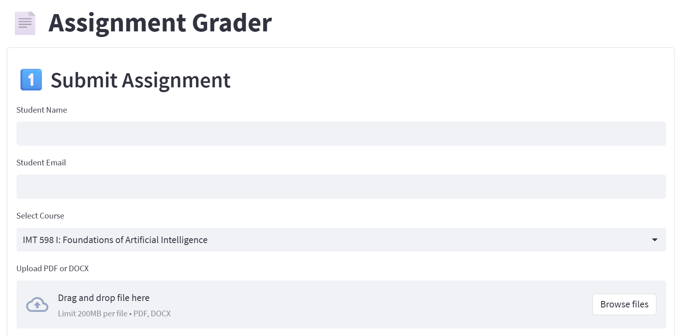

# 📄 Assignment Grader App

A streamlined web app that helps graders evaluate student assignments with AI-generated rubric scoring and instant grade computation.



---

## 🚀 Features

- 📤 Upload PDF or DOCX student submissions
- 🤖 Generate scorecards using ChatGPT + custom rubric
- 📊 Automatic score and grade calculation (A to F)
- 🧠 Save all grading data in local SQLite DB
- 📈 Export submission log to CSV
- 🔁 Easy “New Submission” flow with form reset

---

## 🛠 Technologies Used

- Python 3.x
- [Streamlit](https://streamlit.io/)
- SQLite
- `PyPDF2`, `python-docx`
- Pandas

---

## 📦 Setup Instructions

```bash
# 1. Navigate into the app folder
cd assignment-grader-app

# 2. (Optional) Set up a virtual environment
python -m venv venv
source venv/bin/activate   # Windows: venv\Scripts\activate

# 3. Install dependencies
pip install -r requirements.txt

# 4. Run the app
streamlit run app.py
